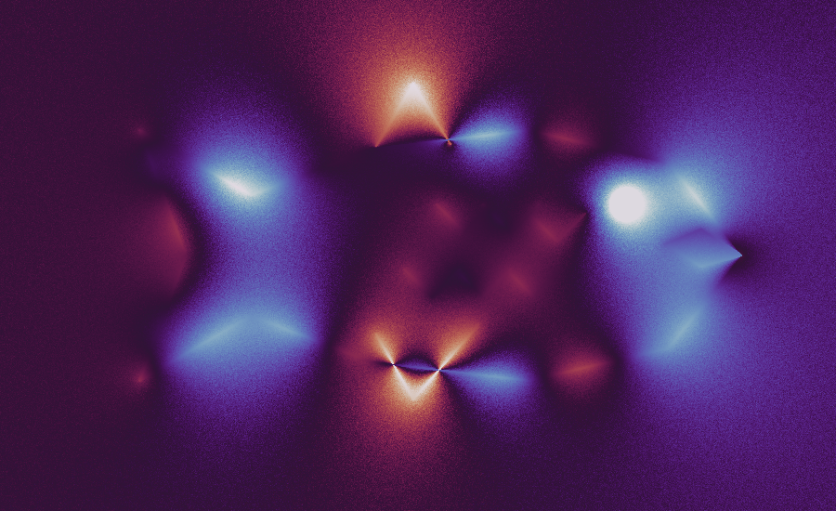
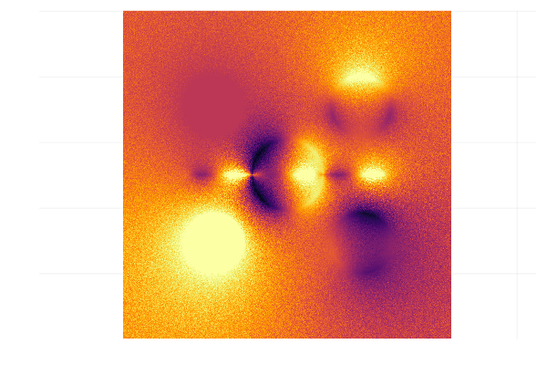
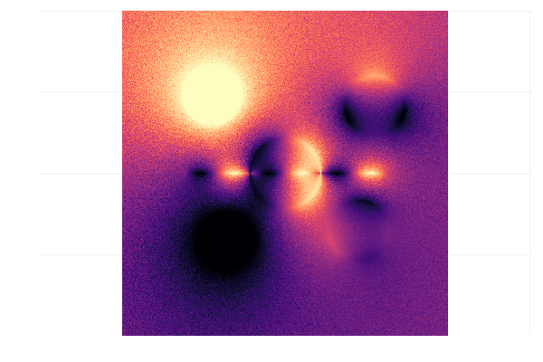
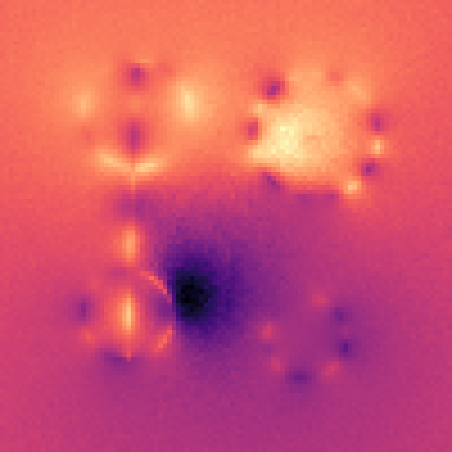

# mcfishy

A Julia implementation of Monte Carlo geometry processing in 2D space.

It solves the Poisson equation:

$$\Delta u = f, x\in\Omega$$

with boundary Dirichlet boundary conditions

$$u(x) = g(x), x\in \partial\Omega$$

using the recursive Walk on Spheres method.



## Quick guide

#### Create a boundary scene
Create geometric objects and assign boundary conditions to them. A scene is defined to be the union of geometric objects with some boundary condition(s).
```
circle₁ = Circle(Point(-2.0, 0.0), 1.0)
bc₁(x) = sin(5x.x) + cos(3x.y)

circle₂ = Circle(Point(2.0, 0.0), 1.0)
bc₂(x) = 2.0 + cos(4x.x)

line = LineSegment(Point(-3.0, -2.0), Point(3.0, -2.0))

∂Ω = scene((circle₁, bc₁),(circle₂, bc₂), (line, x -> 0.0))
```
#### Create a rendering domain
Define the region over which the solution can be evaluated. The domain needs to be discretised into a lattice to be able to be displayed on a computer.
```
Ω = makeDomain(10.0, 10.0)
grid = discretize(Ω, 200, 200)
```

#### Solve the Poisson equation 
Make a source function 
```
c = Point(0, 0) # centre of gaussian distribution
f(x) = exp(-(x→c)⋅(x→c))
```
and solve the Poisson equation:
```
u(x) = solvePoisson(x, ∂Ω, f, WoS_depth, num_Samples, ϵ)
```

If the source function is zero, i.e. $f = 0$, then the Poission equation reduces to the Laplace equation and use the Laplace solver instead.
```
u(x) = solveLaplace(x, ∂Ω, WoS_depth, num_Samples, ϵ)
```

Evaluate the solution on the rendering domain
```
rendering = render(u, grid)
```

#### Visualise the solution
```
image = viewImage(rendering, ColorSchemes.magma)
image
```

## Example outputs


Animated Boundary Conditions




Animated geometries




Poisson equation solution

