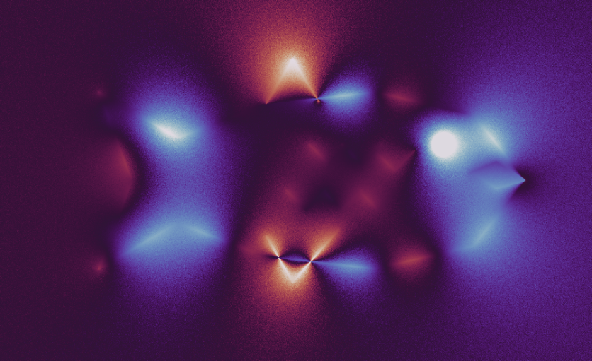
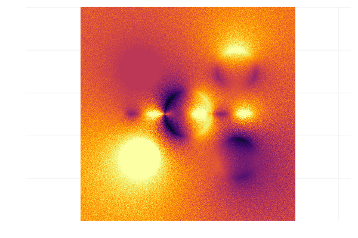
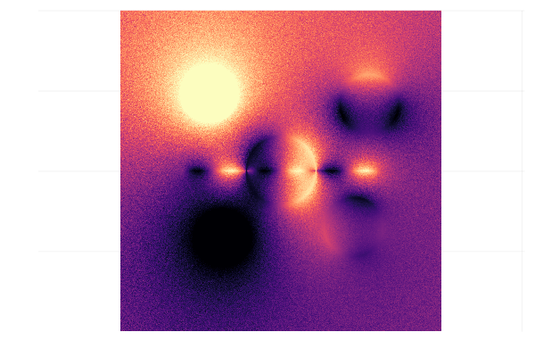
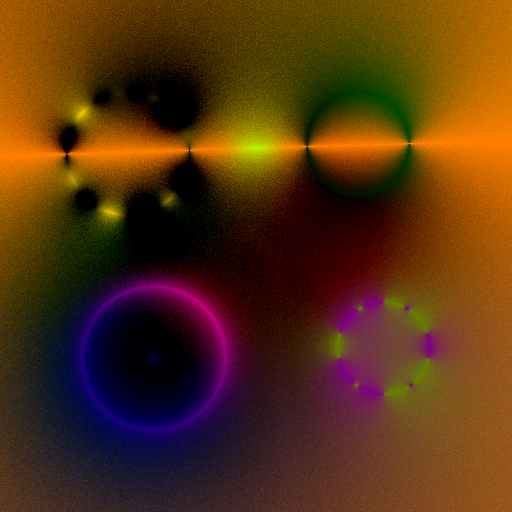
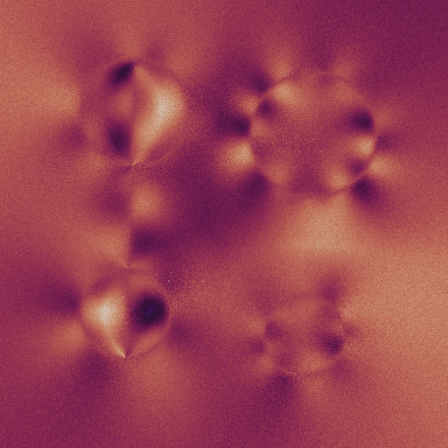

# mcfishy

A Julia implementation of Monte Carlo geometry processing in 2D space.

It solves the Poisson equation:

$$\Delta u(\mathbf{x}) = f(\mathbf{x}), \quad\quad \mathbf{x}\in\mathbb{R}^2$$

with boundary Dirichlet boundary conditions

$$u(\mathbf{x}) = g(\mathbf{x}), \quad\quad \mathbf{x}\in \Gamma$$

using the recursive Walk on Spheres method.

Here, $\Gamma$ is the boundary of solid objects defined in a scene.



### Walk on Spheres
The Poisson equation can be reformulated as 

$$u(\mathbf{x}) = \frac{1}{|\partial B(\mathbf{x})|}\int_{\partial B(\mathbf{x})} u(\mathbf{y}) d\mathbf{y} - \int_{B(\mathbf{x})} f(\mathbf{y})G(\mathbf{x}, \mathbf{y}) d\mathbf{y}.$$

where $G$ is a convolution kernel (more specifically, Green's function), and $B(\mathbf{x})$ is a ball centered at $\mathbf{x}$. When rewritten as an integral equation, the Poisson equation can hence be solved via Monte Carlo methods. 

The algorithm for evaluating the solution to the Poisson equation at a point $\mathbf{x}_0$ in the domain is 

$$u(\mathbf{x}_0)\approx\frac{1}{N}\sum_{i=1}^N \hat u(\mathbf{x}_0)$$

where $N$ is the number of Monte Carlo samples to collect, and  

$$\hat u(\mathbf{x}_k) :=
\begin{cases}
    g(\mathbf{x}_k) & \text{if }\mathbf{x}_k\in\Gamma \\
    \hat u(\mathbf{x}_{k+1}) - |B(\mathbf{x}_k)|f(\mathbf{y}_k)G(\mathbf{x}_k, \mathbf{y}_k)  & \text{otherwise}
\end{cases} $$

with $\mathbf{x}_{k+1}$ drawn a uniform distribution on the largeset sphere around $\mathbf{x}_k$. 

The algorithm will almost certainly never terminate, so when $d(\mathbf{x}\_k, \mathbf{x}\_{k+1})$ is less than some small value $\varepsilon$, it terminates and evaluates $g(\mathbf{\bar x}_k)$ where $\mathbf{\bar x}$ is the point on the boundary  closest to the point $\mathbf{x}_k$, i.e. $\mathbf{\bar x}\_k = \underset{\mathbf{z}\in\partial\Omega}{\text{arg min }} d(\mathbf{x},\mathbf{z})$. Other ways of terminating the algorithm is to set an limit to how high $k$ can be.

This repository also includes methods for computing the gradient and curl of the vector field solution to the Poisson equation using Walk-on-Spheres. 
The paper used as a reference was [Monte Carlo Geometry Processing (2020)](http://www.rohansawhney.io/mcgp.pdf) by Sawhney and Crane. To learn more on the theory behind Walk on Spheres, read [MCGP resources](https://github.com/rohan-sawhney/mcgp-resources). 

## Quick guide

#### Create a boundary scene
Model the scene using geometric primitives and assign boundary conditions to them.
```
circle₁ = Circle(Point(-2.0, 0.0), 1.0)
bc₁(x) = sin(5x.x) + cos(3x.y)

circle₂ = Circle(Point(2.0, 0.0), 1.0)
bc₂(x) = 2.0 + cos(4x.x)

line = LineSegment(Point(-3.0, -2.0), Point(3.0, -2.0))
bc_line(x) = 2.0 + sin(4x.x)
```

A scene is defined to be the union of the geometric primitives and their assigned boundary condition(s).
```
∂𝕊 = boundary(circle₁, bc₁) ∪ boundary(circle₂, bc₂) ∪ boundary(line, bc_line)
```

#### Define the source function 
Make a source function 
```
c = Point(0.5, 0.5) # centre of gaussian distribution
f(x) = exp(-(c→x)⋅(c→x))
```

#### Define the solution to the Poisson equation:
```
WoS_depth = 40
num_Samples = 300
ϵ = 0.01
u(x) = solvePoisson(x, ∂𝕊, f, WoS_depth, num_Samples, ϵ)
```
If the source function is $f(x) = 0$, then one can use `solveLaplace(x, ∂𝕊, WoS_depth, num_Samples, ϵ)` instead.

#### Visualize the solution
At this stage, the solution can be evaluated at a single point: `u(Point(0, 0))`, however this is uninteresting.

To observe local properties of $u$, create a domain, $\Omega$, for which the solution is evaluated over.
The domain will then need to be discretised into a lattice, $\sharp\Omega$, to be able to be displayed on a computer.
```
Ω = makeDomain(10.0, 10.0) # continuous rectangular domain [-5,5] × [-5, 5]
♯Ω = discretize(Ω, 200, 200) # 200 x 200 resolution
```

Evaluate the solution $u$ at every point on the discretized rendering domain (this is the part which will take the longest):
```
evaluation = u.(♯Ω.grid)
```

Display the solution over the specified domain
```
image = viewImage(evaluation, ColorSchemes.magma)
image
```

### Vector field implementation
Here, we solved the Poisson equation for a scalar field $u$. If $u$ were to be a vector field, then replace the boundary conditions and source function with vector fields. An example implementation can be seen in `examplevectorField.jl`.

## Example outputs


Animated Boundary Conditions




Animated geometries




Poisson equation solution for color fields using [mcguppy](https://github.com/Beeflats/mcguppy).



If the solution to the Poisson equation is a vector field, the `solvePoissonGradient` and `solvePoissonCurl` can be used. The image above is the curl of a 2D vector field.

More outputs can be viewed in the `images` directory.

## Next steps
- Extend solver for 3D domains
- Visualise 2D vector fields [[paper](https://vc.tf.fau.de/publications/Tian25EuroVisShort/Tian25EuroVisShort.pdf)]
- Visualise cross sections of 3D fields
- Visualise 3D scalar (and vector) fields
- Visualise 2D endomorphism fields
